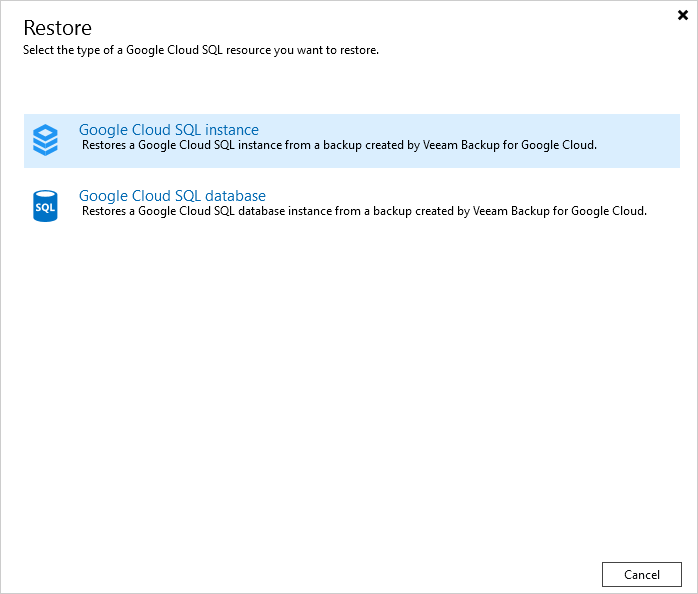

In this article

To launch the Restore to Google Cloud SQL wizard, do the following:

1. In the Veeam Backup & Replication console, open the Home view.
2. Navigate to Backups > Snapshots if you want to restore from a cloud-native snapshot, or to Backups > External Repository if you want to restore from an image-level backup.

|  |
| --- |
| Note |
| Note that restore of Cloud SQL instances to the original location is supported only from image-level backups. |

1. In the working area, expand the backup policy that protects a Cloud SQL instance you want to restore and select the necessary instance. Then, click Google Cloud SQL on the ribbon and select Google Cloud SQL instance in the Restore window.

Alternatively, you can right-click the instance and select Restore to Google Cloud SQL. In the Restore window, select Google Cloud SQL instance.

|  |
| --- |
| Tip |
| You can also launch the Restore to Google Cloud SQL wizard from the Home tab. To do that, click Restore and select GCP. Then, in the Restore window, select Google Cloud SQL and, depending on whether you want to restore from a backup or a snapshot, select either Restore from Google Cloud SQL snapshot or Restore from Veeam backup. |

Page updated 11/14/2025

Page content applies to build 7.0.0.47
