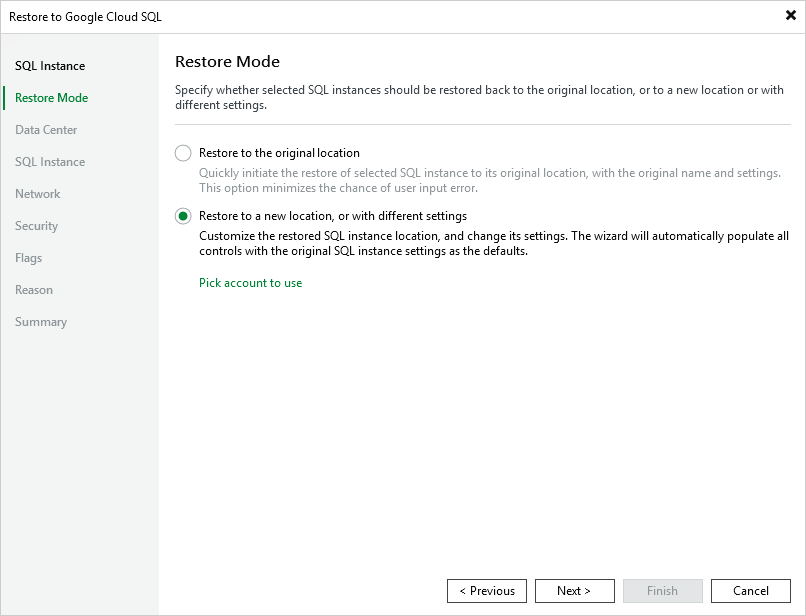

# Step 3. Choose Restore Mode

At the Restore Mode step of the wizard, do the following:

1. Choose whether you want to restore Cloud SQL instance to the original or to a new location.

|  |
| --- |
| Note |
| Due to [technical limitations in Google Cloud](https://cloud.google.com/sql/docs/troubleshooting#managing-instances), Veeam Backup & Replication does not support restore to the original location if the source Cloud SQL instance is still present in the location, if it has been recently deleted (less than a week ago), or if its name is reserved. |

1. Click Pick account to use to select a service account whose permissions will be used to perform the restore operation. For more information on the required permissions for service accounts, see [Service Account Permissions](restore_permissions.md#sql).

For a service account to be displayed in the list of available accounts, it must be added to the backup appliance as described in section [Adding Service Accounts](adding_service_accounts.md), and must be assigned the Cloud SQL Instances Restore operational role as described in section [Adding Projects and Folders](adding_projects.md).

|  |
| --- |
| Note |
| By default, to perform the restore operation, Veeam Backup & Replication uses permissions of the service account that has been used to protect the source Cloud SQL instance. |

