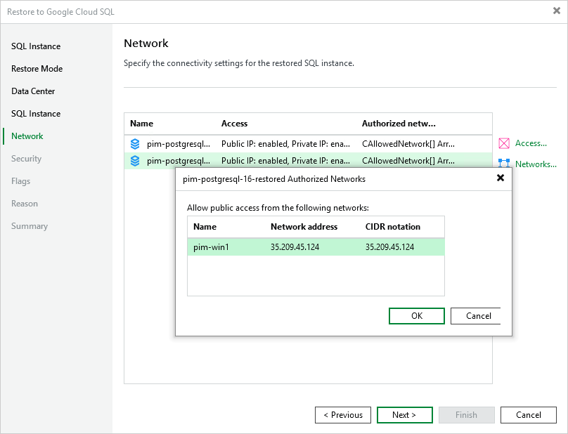

# Step 6. Configure Network Settings

[This step applies only if you have selected the Restore to a new location, or with different settings option at the Restore Mode step of the wizard]

At the Network step of the wizard, you can configure specific network settings for the restored Cloud SQL instance. To do that, select the instance and do the following:

* If you want to connect the restored Cloud SQL instance to a VPC network with a private IP address, click Access. In the Access Settings window, select the Assign a private IP address from following Virtual Private Network check box, choose a VPC network to which the instance will be connected, and click OK.

For a VPC network to be displayed in the lists of available networks, it must be created in the Google Cloud for the region specified at [step 4](restore_sql_instance_region.md) of the wizard, as described in [Google Cloud documentation](https://cloud.google.com/vpc/docs/create-modify-vpc-networks).

|  |
| --- |
| Important |
| The specified VPC network must have Private Service Connect configured. For more information, see [Google Cloud documentation](https://cloud.google.com/vpc/docs/private-service-connect). |

* If you want to assign a public IPv4 address to the restored Cloud SQL instance and to accept connections to it from specific IP address ranges, click Access. In the Access Settings window, select the Assign a public IP address check box and click OK.

Then, click Network. In the Authorized Networks window, add the allowed IP address ranges and click OK. The IP address ranges must be specified in the CIDR notation (for example, 12.23.34.0/24).

|  |
| --- |
| Tip |
| To let all IP addresses access the restored Cloud SQL instance, you can enter 0.0.0.0/0. However, note that allowing access from all IP addresses is unsafe and thus not recommended in production environments. |

