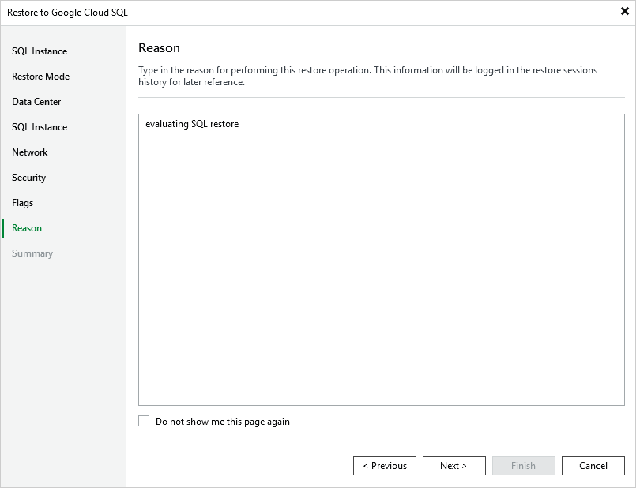

In this article

At the Reason step of the wizard, specify a reason for restoring the Cloud SQL instance. The information you provide will be saved in the session history and you can reference it later.

Page updated 11/14/2025

Page content applies to build 7.0.0.47
