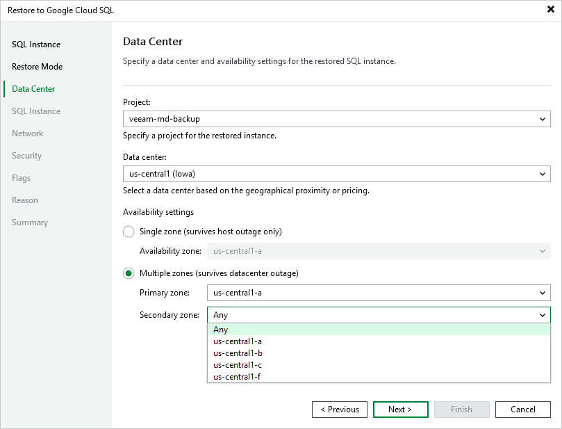

In this article

[This step applies only if you have selected the Restore to a new location, or with different settings option at the Restore Mode step of the wizard]

At the Data Center step of the wizard, select a project that will be used to manage the restored Cloud SQL instance, and specify a region and an availability zone where the restored instance will operate.

For a project to be displayed in the list of available projects, it must be created in Google Cloud as described in [Google Cloud documentation](https://cloud.google.com/resource-manager/docs/creating-managing-projects#creating_a_project).

|  |
| --- |
| Tip |
| To configure the restored Cloud SQL instance for high availability, select the Multiple zones (survives datacenter outage) option, and choose a primary and secondary zone where the restored instance will be located within the selected region. The high availability configuration allows you to reduce downtime when a zone or the instance becomes unavailable. For more information on high availability in Google Cloud, see [Google Cloud documentation](https://cloud.google.com/sql/docs/mysql/high-availability).  Note that this option is available only for restore points created for Cloud SQL instances with high availability enabled. |

Page updated 11/14/2025

Page content applies to build 7.0.0.47
