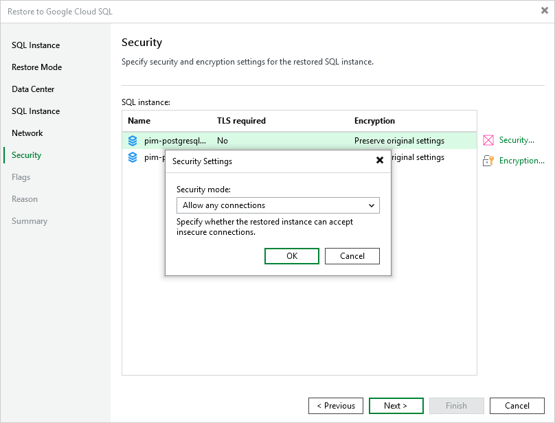

In this article

[This step applies only if you have selected the Restore to a new location, or with different settings option at the Restore Mode step of the wizard]

At the Security step of the wizard, you can configure specific security settings for the restored Cloud SQL instance. To do that, select the instance and do the following:

* If you want to connect to the restored Cloud SQL instance using TLS only, click Security and select the Allow only secure connections (TLS) option in the Security Settings window.

|  |
| --- |
| Note |
| Since TLS connections use digital certificates to provide encrypted access, make sure that you have obtained a Certificate Authority (CA) certificate, a client public key certificate, and a client private key — before you connect to the restored instance using TLS. For more information, see [Google Cloud documentation](https://cloud.google.com/sql/docs/mysql/connect-admin-ip#connect-ssl). |

If you do not want to connect to the restored Cloud SQL instance using TLS, select the Allow any connections option.

* If you want to change the encryption settings of the restored Cloud SQL instance, click Encryption and do the following in the Disk Encryption window:

* If you do not want to encrypt the restored data or want to apply the existing encryption scheme, select the Preserve the original encryption settings option.

* If you want to encrypt the restored data with a Google Cloud KMS CMEK, select the Use the following encryption key option. Then, select the necessary CMEK from the drop-down list.

For a CMEK to be displayed in the list of available encryption keys, it must be stored in the region selected at [step 4](restore_sql_instance_region.md) of the wizard.

|  |
| --- |
| Note |
| The Preserve the original encryption settings option is disabled if the CMEK that was used to encrypt data of the source instance is not available in the region to which the Cloud SQL instance will be restored. |

Page updated 11/14/2025

Page content applies to build 7.0.0.47
