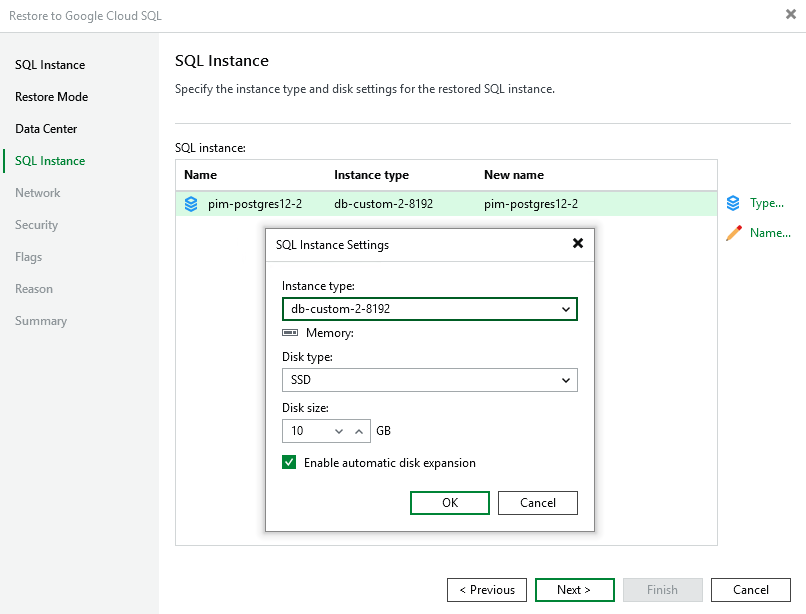

# Step 5. Specify Instance Type and Name

[This step applies only if you have selected the Restore to a new location, or with different settings option at the Restore Mode step of the wizard]

At the SQL instance step of the wizard, specify a new name for the restored Cloud SQL instance.

|  |
| --- |
| Tip |
| You can specify a single prefix or suffix and add it to the names of multiple Cloud SQL instances. To do that, select the necessary instances and click Name. In the Change Name window, select the Add prefix or Add suffix check box, and provide the text that you want to add. Then, click OK. |

You can also configure the following settings:

* You can specify a new machine type for the restored Cloud SQL instance. To do that, select the instance and click Type. Then, select the necessary type in the SQL Instance Settings window.

To learn how to choose the machine type when creating a Cloud SQL instance in Google Cloud, see [Google Cloud documentation](https://cloud.google.com/compute/docs/machine-types).

* You can choose a new disk storage type or increase (either manually or automatically) storage capacity for the restored Cloud SQL instance. To do that, select the instance and click Type. Then, use the options in the Memory section of the SQL Instance Settings window. Note, however, that the amount of storage capacity allocated to an instance affects its cost.

To learn how to configure storage settings when creating a Cloud SQL instance in Google Cloud, see [Google Cloud documentation](https://cloud.google.com/sql/docs/mysql/instance-settings#storage-type-2ndgen).

