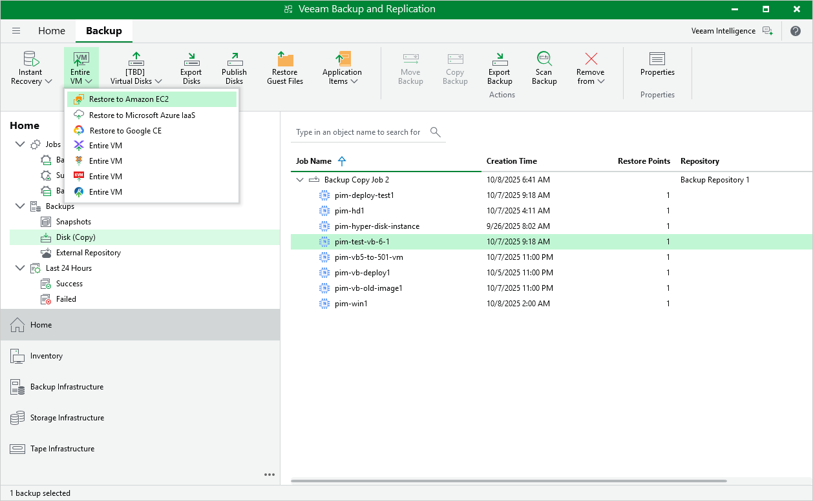

# Restoring to AWS

Veeam Backup & Replication allows you to restore VM instances from image-level backups created with Veeam Backup for Google Cloud to AWS as EC2 instances. You can restore VM instances to any available restore point. For more information, see the Veeam Backup & Replication User Guide, section [Restore to Amazon EC2](https://helpcenter.veeam.com/docs/vbr/userguide/restore_amazon.html?ver=13).

|  |
| --- |
| Important |
| Restore to AWS can be performed only using backup files stored in backup repositories for which you have specified HMAC keys associated with the service accounts that are used to access the repositories. To learn how to specify credentials for repositories, see sections [Creating New Repositories](add_repo_service_account.md) and [Connecting to Existing Appliances](connect_appliance_repo.md). |

Before you start the restore operation, check the limitations and prerequisites described in the Veeam Backup & Replication User Guide, section [Before You Begin](https://helpcenter.veeam.com/docs/vbr/userguide/restore_amazon_byb.html?ver=13).

To restore a VM instance to Amazon EC2, do the following:

1. In the Veeam Backup & Replication console, open the Home view.
2. Navigate to Backups > External Repository.
3. Expand the backup policy that protects a VM instance that you want to restore, select the necessary instance and click Amazon EC2 on the ribbon.

1. Complete the Restore to Amazon EC2 wizard as described in the Veeam Backup & Replication User Guide, section [Restoring to Amazon EC2](https://helpcenter.veeam.com/docs/vbr/userguide/restore_amazon_account.html?ver=13).

