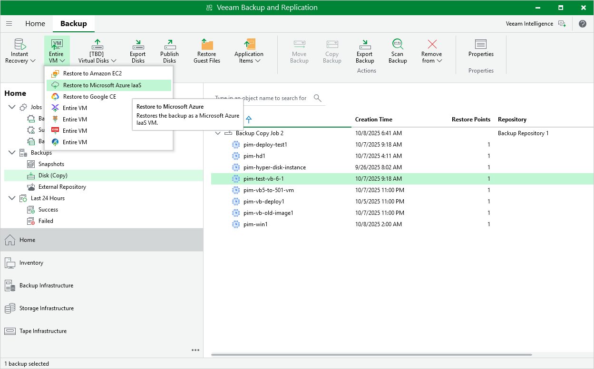

In this article

Veeam Backup & Replication allows you to restore VM instances from image-level backups created with Veeam Backup for Google Cloud to Microsoft Azure as Azure VMs. You can restore VM instances to any available restore point. For more information, see the Veeam Backup & Replication User Guide, section [Restore to Microsoft Azure](https://helpcenter.veeam.com/docs/vbr/userguide/restore_azure.html?ver=13).

|  |
| --- |
| Important |
| Restore to Microsoft Azure can be performed only using backup files stored in backup repositories for which you have specified HMAC keys associated with the service accounts that are used to access the repositories. To learn how to specify credentials for repositories, see sections [Creating New Repositories](add_repo_service_account.md) and [Connecting to Existing Appliances](connect_appliance_repo.md). |

Before you start the restore operation:

* Configure the initial settings of an Azure account or Azure Stack account as described in the Veeam Backup & Replication User Guide, section [Configuring Initial Settings](https://helpcenter.veeam.com/docs/vbr/userguide/restore_azure_setup.html?ver=13).

* Check the limitations and prerequisites described in the Veeam Backup & Replication User Guide, section [Before You Begin](https://helpcenter.veeam.com/docs/vbr/userguide/restore_azure_limitations.html?ver=13).

To restore a VM instance to Microsoft Azure, do the following:

1. In the Veeam Backup & Replication console, open the Home view.
2. Navigate to Backups > External Repository.
3. Expand the backup policy that protects a VM instance that you want to restore, select the necessary instance and click Microsoft Azure Iaas on the ribbon.

1. Complete the Restore to Microsoft Azure wizard as described in the Veeam Backup & Replication User Guide, section [Restoring to Microsoft Azure](https://helpcenter.veeam.com/docs/vbr/userguide/ir_azure_subscription.html?ver=13).

Page updated 11/18/2025

Page content applies to build 7.0.0.47
