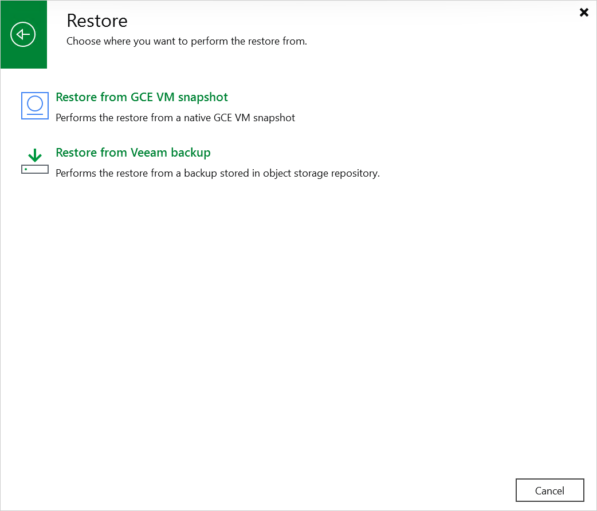

In this article

To launch the Restore to Google Compute Engine wizard, do the following:

1. In the Veeam Backup & Replication console, open the Home view.
2. Navigate to Backups > Snapshots if you want to restore from a cloud-native snapshot, or to Backups > External Repository if you want to restore from an image-level backup.
3. In the working area, expand the backup policy that protects a VM instance that you want to restore, select the necessary instance and click Google CE on the ribbon.

Alternatively, you can right-click the instance and select Restore to Google CE.

|  |
| --- |
| Tip |
| You can also launch the Restore to Google Compute Engine wizard from the Home tab. To do that, click Restore and select GCP. Then, in the Restore window, select Google Compute Engine > Entire machine restore > Restore to public cloud > Restore to Google Compute Engine and, depending on whether you want to restore from a backup or a snapshot, click either Restore from GCE VM snapshot or Restore from Veeam backup. |

Page updated 11/4/2025

Page content applies to build 7.0.0.47
