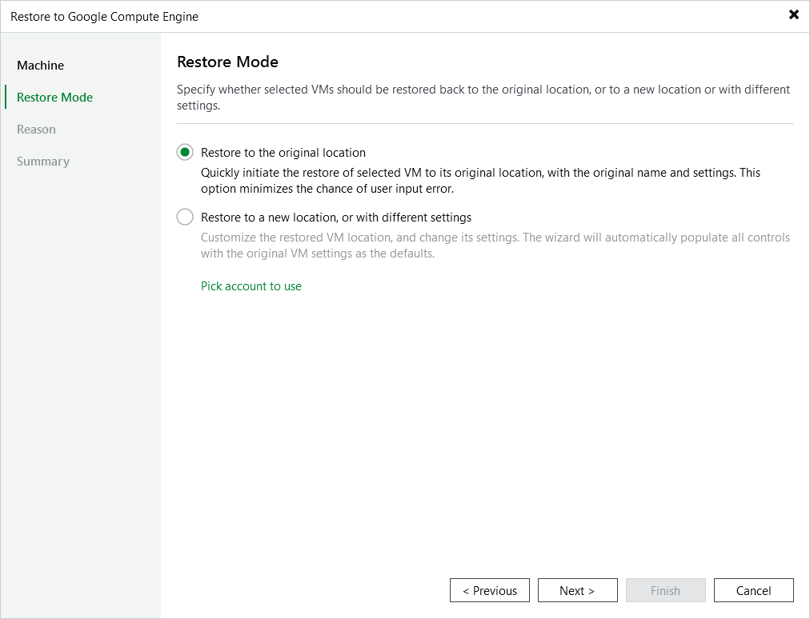

# Step 3. Choose Restore Mode

At the Restore Mode step of the wizard, do the following:

1. Choose whether you want to restore the selected VM instance to the original or to a new location.

|  |
| --- |
| Important |
| When restoring a VM instance to the original location while the source VM instance still exists in Google Cloud, Veeam Backup for Google Cloud restores the instance with a different name, powers off the source VM instance, removes the source instance from the backup infrastructure, and then renames the restored VM instance. To allow the backup appliance to perform these operations, make sure that the [deletion protection](https://cloud.google.com/compute/docs/instances/preventing-accidental-vm-deletion#:~:text=Setting%20deletion%20protection%20during%20instance%20creation,-By%20default%2C%20deletion&text=In%20the%20Google%20Cloud%20console,the%20Create%20an%20instance%20page.&text=Expand%20the%20Networking%2C%20disks%2C%20security,the%20Enable%20deletion%20protection%20checkbox.) setting is disabled for the source instance. |

1. Click Pick account to use to select a service account whose permissions will be used to perform the restore operation. For more information on the required permissions, see [Service Account Permissions](permissions.md).

For a service account to be displayed in the list of available accounts, it must be added to Veeam Backup for Google Cloud as described in section [Adding Service Accounts](adding_service_accounts.md), and must be assigned the VM Instances Restore operational role as described in section [Adding Projects and Folders](adding_projects.md).

|  |
| --- |
| Note |
| By default, to perform restore operations, Veeam Backup & Replication uses permissions of service accounts that have been used to protect the source VM instances. |

