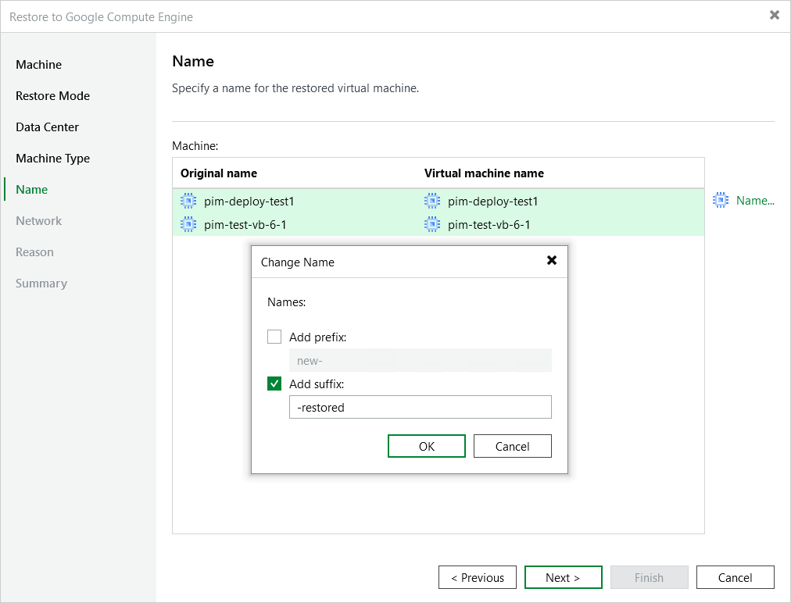

# Step 6. Specify Instance Name

[This step applies only if you have selected the Restore to a new location, or with different settings option at the Restore Mode step of the wizard]

At the Name step of the wizard, specify a new name for the restored VM instance.

|  |
| --- |
| Tip |
| You can specify a single prefix or suffix and add it to the names of multiple VM instances. To do that, select the necessary instances and click Name. In the Change Name window, select the Add prefix or Add suffix check box, and provide the text that you want to add. Then, click OK. |

