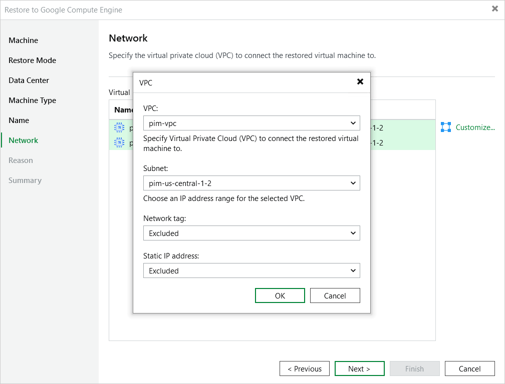

In this article

[This step applies only if you have selected the Restore to a new location, or with different settings option at the Restore Mode step of the wizard]

At the Network step of the wizard, you can select a VPC network and subnet to which the restored VM instance will be connected. To do that, select the VM instance and click Customize. You can also choose whether you want the restored VM instance to have the same network tags and the same reserved static external IP address as the source VM instance — to enable an option, select Included from the drop-down list.

|  |
| --- |
| Note |
| A static external IP address can be assigned to a restored VM instance only if this IP address has been reserved for the source VM instance. To learn how to reserve static external IP addresses for VM instances, see [Google Cloud documentation](https://cloud.google.com/compute/docs/ip-addresses/reserve-static-external-ip-address). |

For a VPC network and subnet to be displayed in the lists of available networks, they must be created for the region specified at [step 4](restore_to_google_region.md) in Google Cloud, as described in [Google Cloud documentation](https://cloud.google.com/vpc/docs/create-modify-vpc-networks).

Page updated 11/4/2025

Page content applies to build 7.0.0.47
