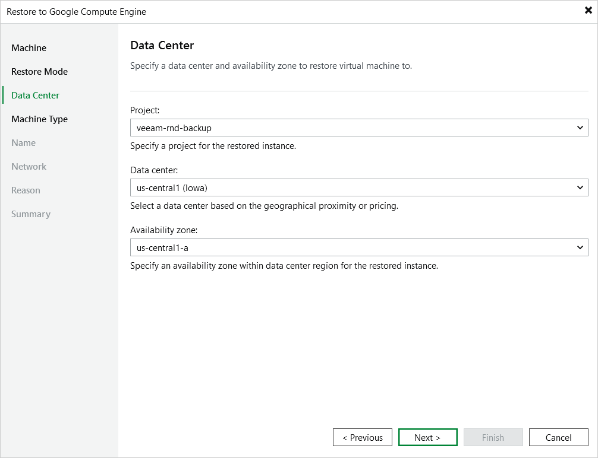

In this article

[This step applies only if you have selected the Restore to a new location, or with different settings option at the Restore Mode step of the wizard]

At the Data Center step of the wizard, select a project that will be used to manage the restored VM instance, and specify a region and availability zone or zones where the restored VM instance will operate.

For a project to be displayed in the list of available projects, it must be created in Google Cloud as described in [Google Cloud documentation](https://cloud.google.com/resource-manager/docs/creating-managing-projects#creating_a_project).

Page updated 11/14/2025

Page content applies to build 7.0.0.47
