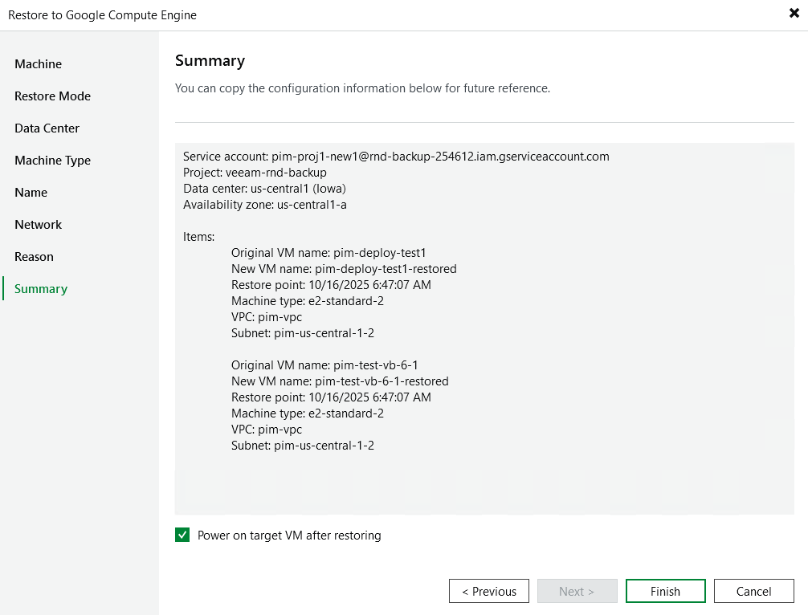

In this article

At the Summary step of the wizard, review summary information and click Finish.

|  |
| --- |
| Tip |
| If you want to start the VM instance immediately after restore, select the Power on target VM after restoring check box. |

Page updated 11/4/2025

Page content applies to build 7.0.0.47
