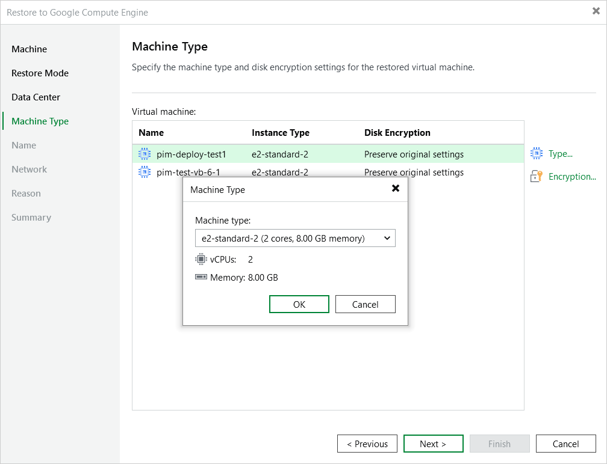

In this article

[This step applies only if you have selected the Restore to a new location, or with different settings option at the Restore Mode step of the wizard]

At the Machine Type step of the wizard, you can configure the restored VM instance settings. To do that, select the instance and do the following:

* If you want to specify a new machine type for the restored VM instance, click Type and select the necessary type in the Machine Type window.

To learn how to choose a machine type when creating a VM instance in Google Cloud, see [Google Cloud documentation](https://cloud.google.com/compute/docs/machine-types).

* If you want to change the encryption settings of the restored VM instance, click Encryption and do the following in the Disk Encryption window:

* If you do not want to encrypt persistent disks of the restored VM instance or want to apply the existing encryption scheme of the source VM instance, select the Preserve the original encryption settings option.
* If you want to encrypt persistent disks of the restored VM instance with a Google Cloud KMS CMEK, select the Use the following encryption key option. Then, choose the necessary CMEK from the list.

For a CMEK to be displayed in the list of available encryption keys, it must be stored in the region selected at [step 4](restore_to_google_region.md) of the wizard.

|  |
| --- |
| Note |
| The Preserve the original encryption settings option is disabled if the CMEK that was used to encrypt persistent disk of the source instance is not available in the region to which the VM instance will be restored. |

Page updated 11/4/2025

Page content applies to build 7.0.0.47
