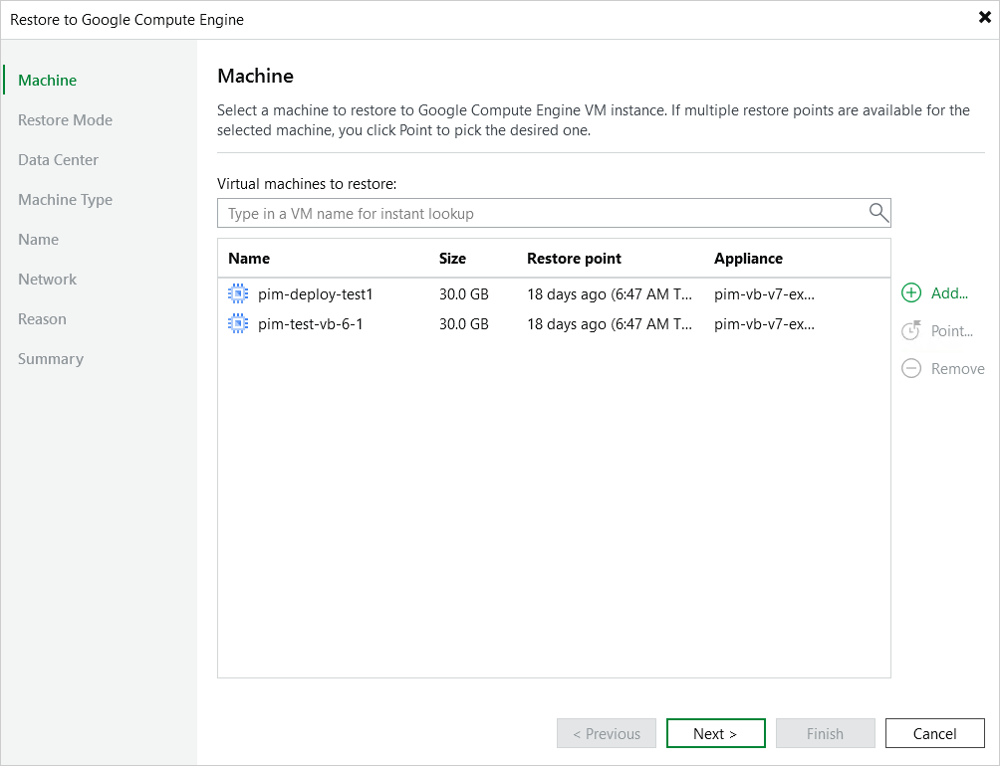

# Step 2. Select Restore Point

At the Machine step of the wizard, choose a restore point that will be used to restore the selected VM instance. By default, Veeam Backup & Replication uses the most recent valid restore point. However, you can restore the instance data to an earlier state.

To select a restore point, do the following:

1. In the Virtual machines to restore list, select the VM instance and click Point.

1. In the Restore Points window, expand the backup policy that protects the VM instance, select the necessary restore point and click OK.

To help you choose a restore point, Veeam Backup & Replication provides the following information on each available restore point:

* Job — the name of the backup policy that created the restore point and the date when the restore point was created.
* Type — the type of the restore point.
* Location — the region or repository where the restore point is stored.

|  |
| --- |
| Tip |
| You can use the wizard to restore multiple instances at a time. To do that, click Add VM, select more VM instances to restore and choose a restore point for each of them. |

