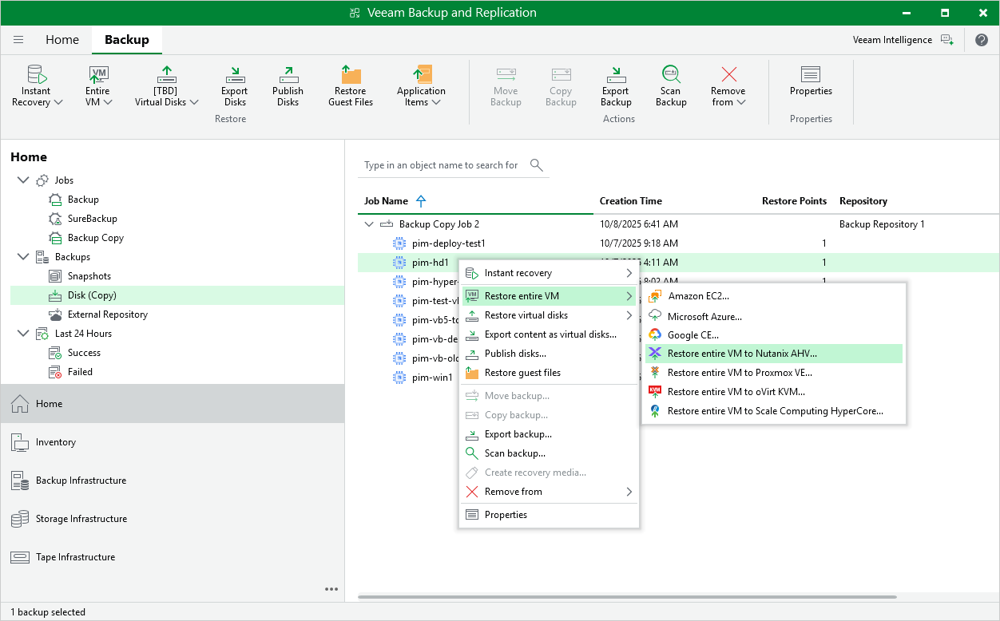

In this article

Restoring to Nutanix AHV

Veeam Backup & Replication allows you to restore VM instances from image-level backups created with Veeam Backup for Google Cloud to Nutanix AHV as Nutanix AHV VMs. You can restore VM instances to any available restore point. For more information, see the Veeam Plug-in for Nutanix AHV User Guide, section [Performing Restore](https://helpcenter.veeam.com/docs/vbahv/userguide/instant_recovery_ahv.html?ver=8).

|  |
| --- |
| Important |
| Restore to Nutanix AHV can be performed only using backup files stored in backup repositories for which you have specified HMAC keys associated with the service accounts that are used to access the repositories. To learn how to specify credentials for repositories, see sections [Creating New Repositories](add_repo_service_account.md) and [Connecting to Existing Appliances](connect_appliance_repo.md). |

Before you start the restore operation:

* Configure the backup infrastructure as described in the Veeam Plug-in for Nutanix AHV User Guide, section [Configuring](https://helpcenter.veeam.com/docs/vbahv/userguide/configuration.html?ver=8).

* If you restore VM instances from standard backups, make sure that these backups have been copied to an on-premises backup repository as described in the Veeam Backup & Replication User Guide, section [Creating Backup Copy Jobs for VMs and Physical Machines](https://helpcenter.veeam.com/docs/vbr/userguide/backup_copy_create.html?ver=13).

* If you restore VM instances from backups copied to the archive access tier of a [scale-out backup repository](https://helpcenter.veeam.com/docs/vbr/userguide/archive_tier.html?ver=13), make sure that you have retrieved these backups from archive as described in the Veeam Backup & Replication User Guide, section [Retrieving Backup Files](https://helpcenter.veeam.com/docs/vbr/userguide/archive_tier_retrieval.html?ver=13).

To restore a VM instance to a Nutanix AHV cluster, do the following:

1. In the Veeam Backup & Replication console, open the Home view.
2. Navigate to Backups > Disk (Copy).
3. Expand the backup job that protects a VM instance that you want to restore, select the necessary instance and click Entire VM on the ribbon.

Alternatively, right-click the VM instance and select Restore entire VM > Restore entire VM to Nutanix AHV.

1. Complete the Restore to Nutanix AHV wizard as described in the Veeam Plug-in for Nutanix AHV User Guide, section [Restoring VMs Using Veeam Backup & Replication Console](https://helpcenter.veeam.com/docs/vbahv/userguide/restore_to_ahv_select_vms.html?ver=8).

Page updated 11/18/2025

Page content applies to build 7.0.0.47
