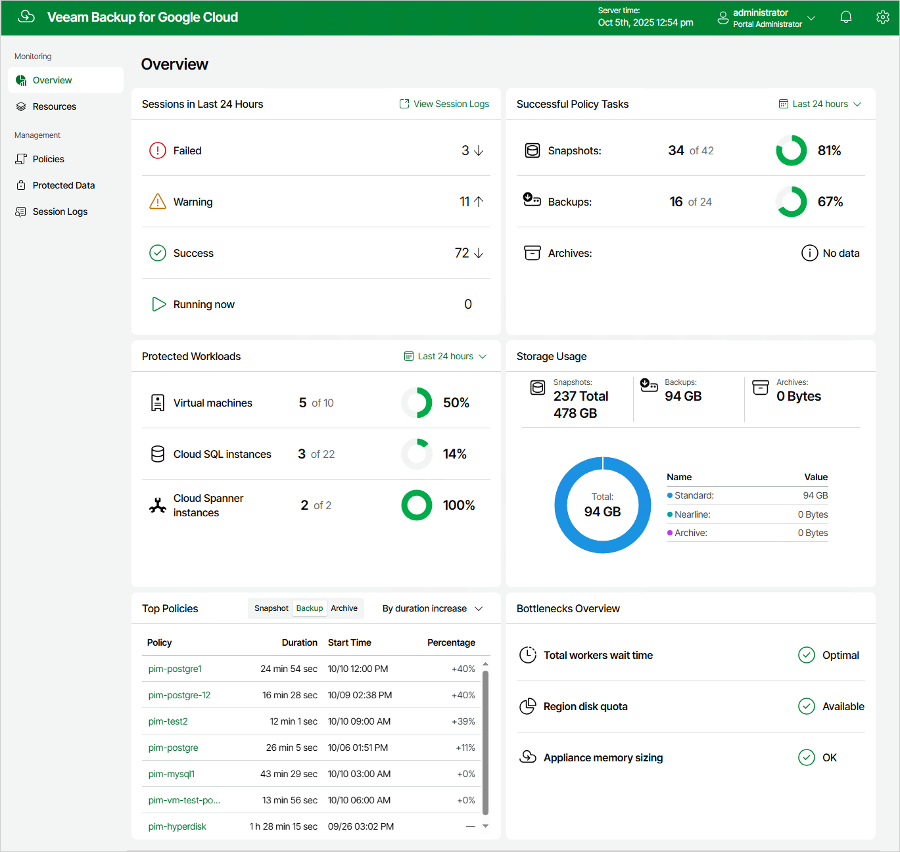

In this article

Veeam Backup for Google Cloud comes with an Overview dashboard that provides at-a-glance real-time overview of the protected Google Cloud resources and allows you to estimate the overall backup performance. The dashboard includes the following widgets:

* Sessions in Last 24 Hours — displays the number of all sessions started for data protection and disaster recovery operations (including system sessions) that completed successfully during the past 24 hours, the number of sessions that completed with warnings, the number of sessions that completed with errors, and the number of sessions that are currently running.

To get more information on the sessions, click either View Session Logs or any of the widget rows. In the latter case, the Session Logs page will show only those sessions that have the same status as that clicked in the widget.

For more information on the Session Logs page, see [Viewing Session Statistics](viewing_session_statistics.md).

* Successful Policy Tasks — displays the number of snapshots, backups and archived backups successfully created by backup policies during a specific time period (the past 24 hours by default), and the number of attempts that were made to create these restore points.

To specify the time period, click the link next to the Schedule icon. To get more information on the created snapshots, backups or archived backups, click any of the widget rows. In the latter case, the Session Logs page will show only those sessions during which Veeam Backup for Google Cloud created the same items as that clicked in the widget.

For more information on the Session Logs page, see [Viewing Session Statistics](viewing_session_statistics.md).

* Top Policies — shows top 8 backup policies for fluctuations in execution time (including retries). For each policy, the widget calculates the growth rate to detect whether it took less or more time for the policy to complete in comparison with the average runtime value for the previous 10 policy launches.
* Protected Workloads — displays the number of available Google Cloud resources that got protected by Veeam Backup for Google Cloud during a specific time period (the past 24 hours by default).

To specify the time period, click the link next to the Schedule icon. To get more information on the protected resources, click any of the widget rows.

For more information on the available resources, their properties and the actions you can perform for the resources, see [Viewing Available Resources](viewing_resources.md).

* Storage Usage — displays the amount of storage space that is currently consumed by backups and archived backups created by Veeam Backup for Google Cloud in storage buckets, the number of snapshots created for the protected resources, and the total size of all VM instance snapshots residing in Google Cloud Storage. The widget also calculates the ratio of the total amount of storage space used in the Standard and Nearline storage classes to the total amount of storage space used in the Archive storage class.
* Bottlenecks Overview — is designed to help you avoid possible backup bottlenecks.

The widget analyzes the total amount of time waited to deploy worker instances during data protection operations in different Google Cloud regions, and displays the most problematic region (if any).

The widget also analyzes the amount of disk quota across all regions to detect whether the quota has already been reached in any of the regions, and whether Veeam Backup for Google Cloud failed to deploy a worker instance with the primary profile in that region during a backup or restore process. For more information on machine types of VM instances that operate as worker instances, see [Managing Worker Profiles](managing_worker_profiles.md).

The widget also analyzes memory usage on the backup appliance, and displays a warning if the memory usage keeps breaching the preconfigured threshold (80%) for 60 minutes in a row. If the problem persists, the only way to resolve the issue may be to change the machine type for the backup appliance as described in [Google Cloud documentation](https://cloud.google.com/compute/docs/instances/changing-machine-type-of-stopped-instance).

To learn how to resolve a bottleneck, click the How to resolve? link in the widget row.

Page updated 11/14/2025

Page content applies to build 7.0.0.47
