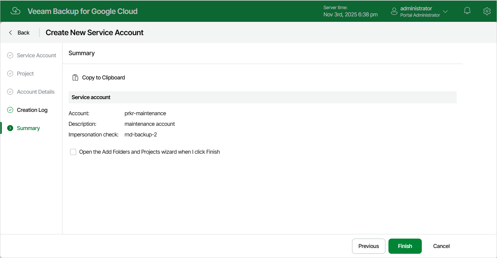

In this article

At the Summary step of the wizard, review summary information and click Finish.

|  |
| --- |
| Tip |
| If you want to associate the newly added service account with a project or folder, select the Open the Add Projects and Folders wizard when I click Finish check box. |

Page updated 11/14/2025

Page content applies to build 7.0.0.47
