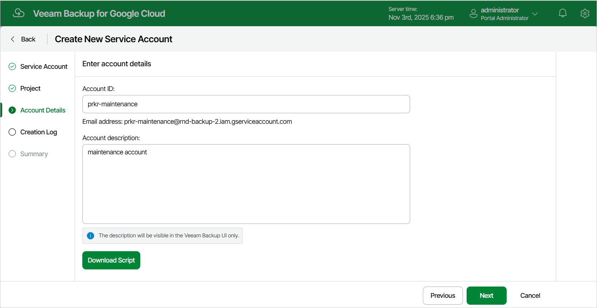

In this article

At the Account Details step of the wizard, do either of the following:

* If you have selected the Add existing account option at the Service Account step of the wizard, use the Email and Description fields to specify an email address generated for the service account upon the account creation and to provide a description for future reference.
* If you have selected the Create new account option at the Service Account step of the wizard, use the Account ID and Description fields to specify an ID for the new service account and to provide a description for future reference.

The minimum length of the account ID is 6 characters. The following characters are supported: lowercase Latin letters, numeric characters and hyphens.

|  |
| --- |
| Note |
| If you have not signed in to Google Cloud at [step 3](service_account_project.md) of the wizard, Veeam Backup for Google Cloud will try to use the [default service account](managing_service_accounts.md#default) to create the new service account automatically. If the default service account is missing the necessary permissions required to create service accounts in the specified project, you can generate a gcloud script and run it in the Google Cloud console to create the account manually. To generate the script, click Download Script.  The account under which you run the script must have the permissions described in [Google Cloud documentation](https://cloud.google.com/iam/docs/creating-managing-service-accounts#permissions). |

Page updated 11/14/2025

Page content applies to build 7.0.0.47
