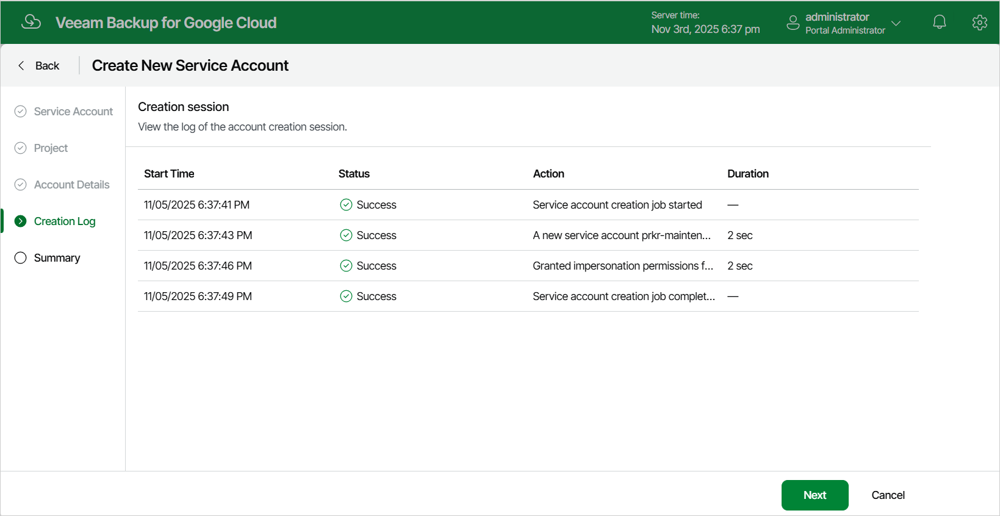

In this article

[This step applies only if you have selected the Create new account option at the Service Account step of the wizard]

Veeam Backup for Google Cloud will display the results of every step performed while creating the service account. At the Creation Log step of the wizard, wait for the creation process to complete and click Next.

Page updated 11/14/2025

Page content applies to build 7.0.0.47
