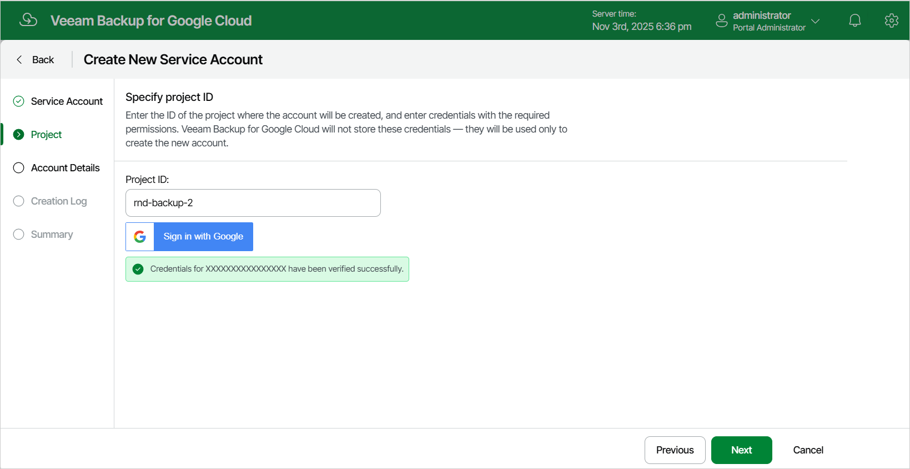

In this article

[This step applies only if you have selected the Create new account option at the Service Account step of the wizard]

At the Project step of the wizard, specify the ID of a project in which the new service account will be created. You can find the project ID on the Dashboard page in the Google Cloud console. For more information, see [Google Cloud documentation](https://cloud.google.com/resource-manager/docs/creating-managing-projects#identifying_projects).

|  |
| --- |
| Tip |
| If you want Veeam Backup for Google Cloud to automatically create a service account in the specified project, click Sign in with Google and specify credentials of a Google account that has [permissions required to create service accounts](https://cloud.google.com/iam/docs/creating-managing-service-accounts#permissions). For Veeam Backup for Google Cloud to be able to authorize in Google Cloud, the OAuth consent screen must be configured as described in section [Registering Applications](registering_applications.md).  Note that Veeam Backup for Google Cloud does not store in the configuration database the Google account credentials provided or access tokens received during authorization. |

Page updated 11/14/2025

Page content applies to build 7.0.0.47
