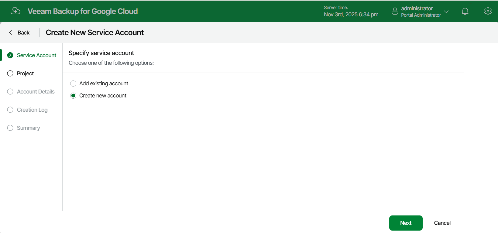

In this article

At the Service Account step of the wizard, choose whether you want to add an already existing service account, or to create a new service account and add it to Veeam Backup for Google Cloud.

Page updated 11/14/2025

Page content applies to build 7.0.0.47
