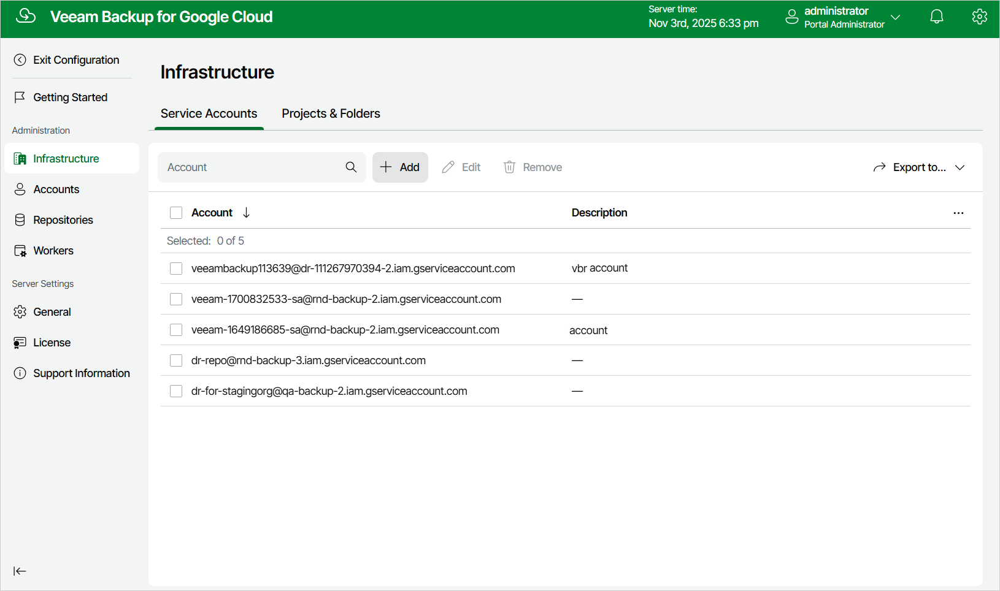

# Step 1. Launch Add Service Account Wizard

To launch the Add Service Account wizard, do the following:

1. Switch to the Configuration page.
2. Navigate to Infrastructure > Service Accounts.
3. Click Add.

