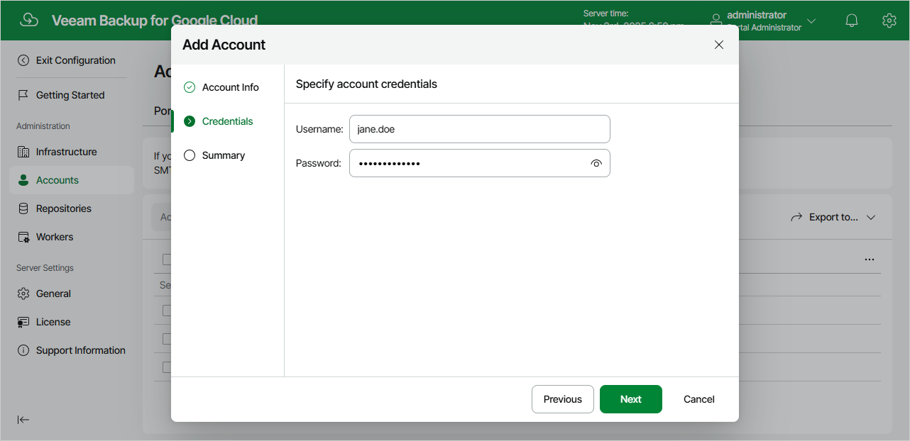

In this article

At the Account step of the wizard, specify credentials of a user account that will be used to authenticate against the SMTP server.

Page updated 11/12/2025

Page content applies to build 7.0.0.47
