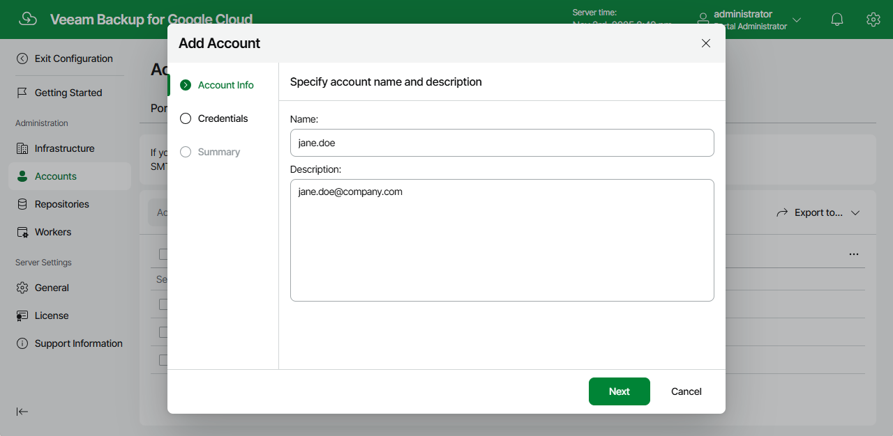

# Step 2. Specify Account Name and Description

At the Account Info step of the wizard, use the Name and Description fields to enter a name for the new SMTP account and to provide a description for future reference. The maximum length of the name is 255 characters.

