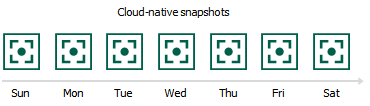

# Snapshot Chain

During every backup session, Veeam Backup for Google Cloud creates a cloud-native snapshot of each VM instance added to a backup policy. The cloud-native snapshot itself is a collection of point-in-time snapshots that Veeam Backup for Google Cloud creates using native Google Cloud capabilities.

A sequence of cloud-native snapshots created during a set of backup sessions makes up a snapshot chain. Veeam Backup for Google Cloud builds the snapshot chain in the following way:

1. During the first backup session, Veeam Backup for Google Cloud creates a snapshot of all instance data and, by default, saves it in the multi-regional location closest to the region in which the original instance resides. This snapshot becomes a starting point in the snapshot chain.

The creation of the first snapshot may take significant time to complete since Veeam Backup for Google Cloud copies the whole image of the instance.

|  |
| --- |
| Tip |
| You can change the default location of cloud-native snapshots created for VM instances in the [backup policy settings](backup_policy_target.md). |

1. During subsequent backup sessions, Veeam Backup for Google Cloud creates snapshots that contain only those data blocks that have changed since the previous backup session.

The creation of subsequent snapshots typically takes less time to complete, compared to the first snapshot in the chain. Note, however, that the completion time still depends on the amount of processed data.

For more information on how incremental VM snapshots work, see [Google Cloud documentation](https://cloud.google.com/compute/docs/disks/snapshots#incremental-snapshots).

Cloud-native snapshots in the snapshot chain are assigned encrypted labels. These labels store information about the protected instances and the backup policies that created the snapshots. Veeam Backup for Google Cloud uses the encrypted labels to identify outdated snapshots, to load the configuration of source instances during recovery operations and so on.

Cloud-native snapshots act as independent restore points for backed-up instances. If you remove any snapshot, it will not break the snapshot chain — you will still be able to roll back instance data to any existing restore point.

The number of cloud-native snapshots kept in the snapshot chain is defined by retention policy settings. For more information, see [VM Snapshot Retention](snapshot_retention_vm.md).

