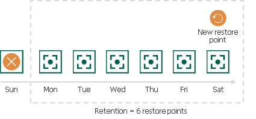

In this article

For cloud-native snapshots, Veeam Backup for Google Cloud retains the number of latest restore points defined in backup scheduling settings as described in section [Creating Spanner Policies](spanner_policy_schedule.md).

During every successful backup session, Veeam Backup for Google Cloud creates a new restore point. If Veeam Backup for Google Cloud detects that the number of restore points in the snapshot chain exceeds the retention limit, it removes the earliest restore point from the chain. For more information on the snapshot deletion process, see [Google Cloud documentation](https://cloud.google.com/spanner/docs/backup).

|  |
| --- |
| Note |
| Retention policy settings configured when creating backup policies do not apply to cloud-native snapshots created manually. To learn how to remove these snapshots, see [Removing Backups and Snapshots](managing_data_ui.md#removing). |

Page updated 2/1/2024

Page content applies to build 7.0.0.47
