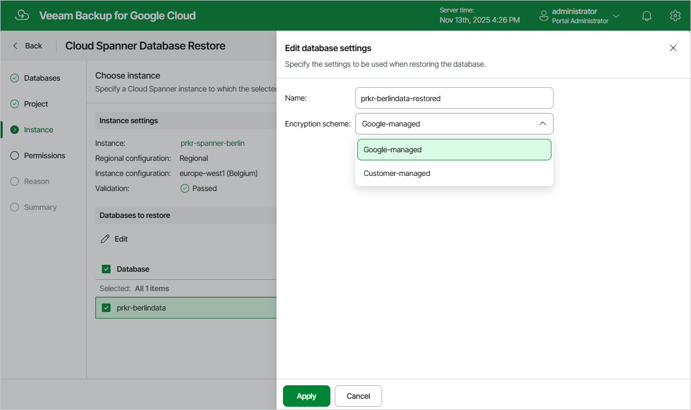

# Step 4. Configure Target Instance Settings

At the Instance step of the wizard, choose a Cloud Spanner instance that will host the restored databases. To do that, click the link in the Instance field, select the necessary Cloud Spanner instance from the Choose Cloud Spanner instance list, and click Apply. For a Cloud Spanner instance to be displayed in the list of available instances, it must belong to the selected project and be running on a supported database engine.

You can also specify new names and choose new encryption schemes for the restored databases. To do that, select a database and click Edit.

|  |
| --- |
| Tip |
| Veeam Backup for Google Cloud will perform a number of configuration checks for the selected instance and databases:   * If any of the checks fail to complete successfully for an instance, the wizard will display an error in the Validation field. * If any of the checks fail to complete successfully for a database, the wizard will display an error in the Validation column of the Databases to restore table.   You can click the link to get more information on an error. |

