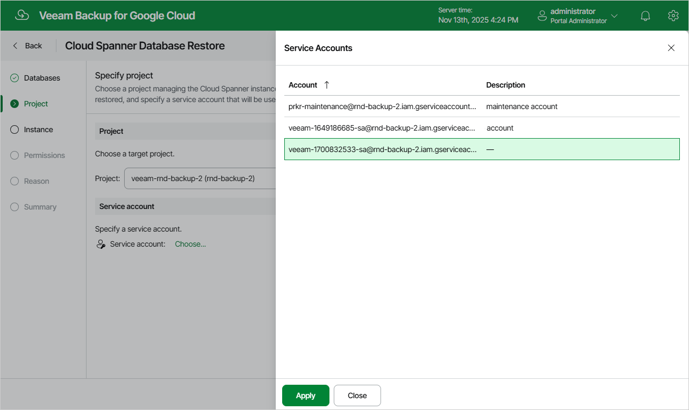

In this article

At the Project step of the wizard, select a project that manages a Cloud Spanner instance to which you want to restore the selected databases and specify a service account whose permissions will be used to perform the restore operation. For more information on the required permissions, see [Service Account Permissions](restore_permissions.md#spanner).

For a project to be displayed in the Project drop-down list, it must be added to Veeam Backup for Google Cloud as described in section [Adding Projects and Folders](adding_projects.md). If you have not added the necessary project to Veeam Backup for Google Cloud beforehand, you can do it without closing the Cloud Spanner Database Restore wizard. To do that, click Add and complete the Add Projects and Folders wizard.

For a service account to be displayed in the list of available accounts, it must be added to Veeam Backup for Google Cloud as described in section [Adding Service Accounts](adding_service_accounts.md), and must be assigned the Cloud Spanner Instances Restore operational role as described in section [Adding Projects and Folders](adding_projects.md).

Page updated 11/14/2025

Page content applies to build 7.0.0.47
