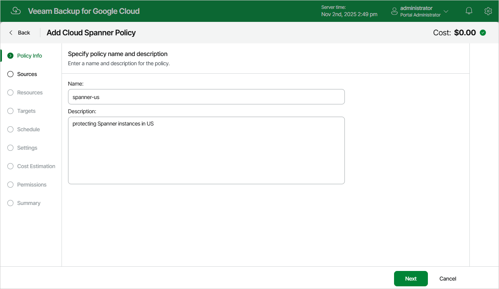

# Step 2. Specify Backup Policy Name and Description

At the Policy Info step of the wizard, use the Name and Description fields to enter a name for the new backup policy and to provide a description for future reference. The policy name can contain only uppercase Latin letters, lowercase Latin letters, numeric characters and hyphens; the maximum length of the name is 127 characters.

