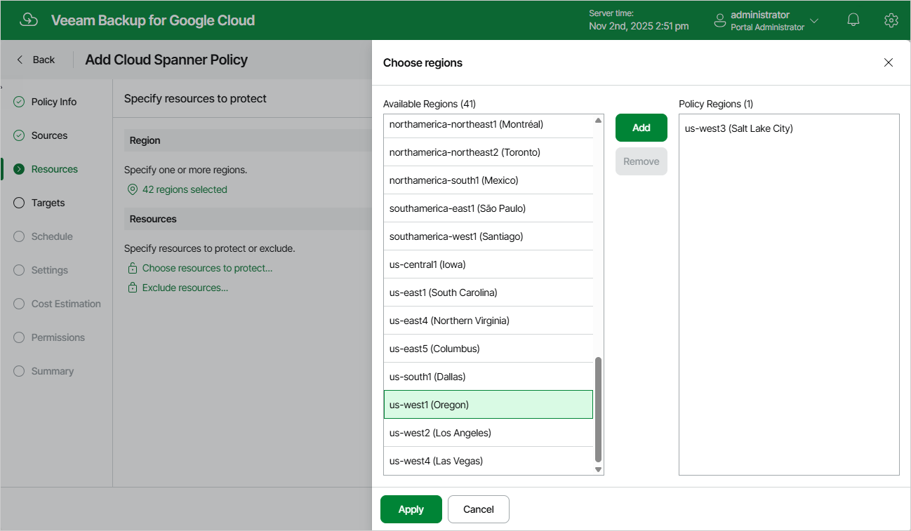

In this article

In the Regions section of the Resources step of the wizard, choose regions in which Cloud Spanner instances that you want to protect reside.

1. Click Choose regions.
2. In the Choose regions window, select the necessary regions from the Available Regions list, and click Add.

1. To save changes made to the backup policy settings, click Apply.

|  |
| --- |
| Important |
| If you want to protect a multi-regional Cloud Spanner instance, you must choose regions where its read-write or read-only replicas are located; witness replicas do not participate in the backup process due to [Google Cloud limitations](https://cloud.google.com/spanner/docs/replication). |

Page updated 11/11/2025

Page content applies to build 7.0.0.47
