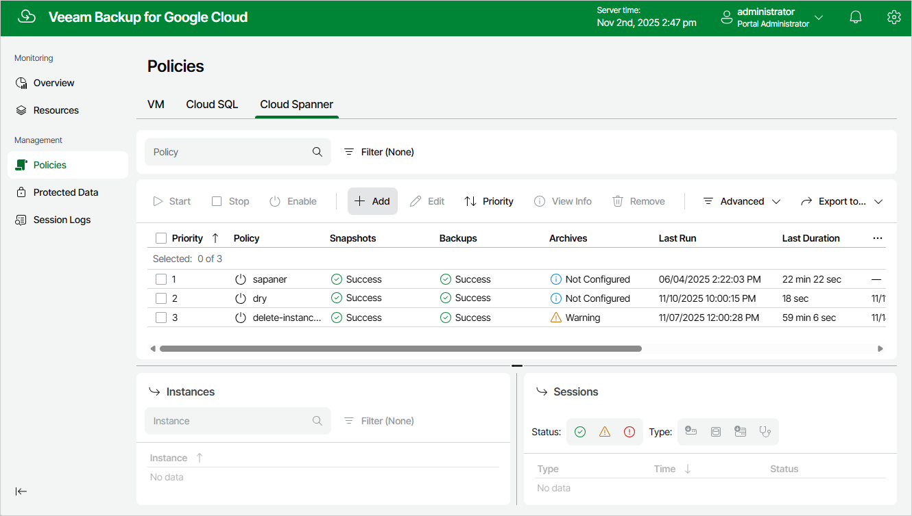

In this article

To launch the Add Cloud Spanner Policy wizard, do the following:

1. Navigate to Policies > Cloud Spanner.
2. Click Add.

Page updated 11/11/2025

Page content applies to build 7.0.0.47
