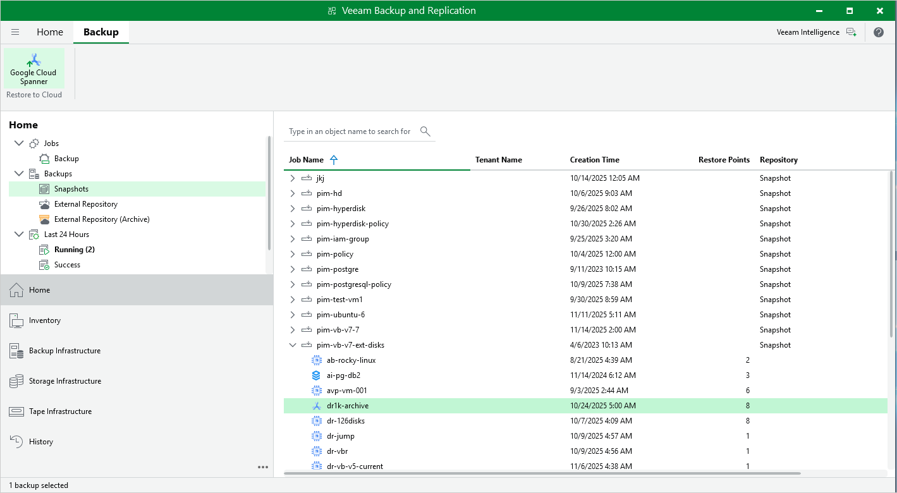

In this article

You can recover corrupted Cloud Spanner instances and databases in the Veeam Backup for Google Cloud Web UI only. However, you can launch the Cloud Spanner Restore wizard directly from the Veeam Backup & Replication console to start the restore operation:

1. In the Veeam Backup & Replication console, open the Home view.
2. Navigate to Backups > Snapshots.
3. Expand the backup policy that protects the Cloud Spanner instances that you want to recover, select the necessary instance and click Google Cloud Spanner on the ribbon.

Alternatively, you can right-click the selected instance and click Restore to Google Cloud Spanner.

Veeam Backup & Replication will open the Cloud Spanner Restore wizard in a web browser. Complete the wizard as described in section [Performing Spanner Restore](spanner_restore_instance.md).

Page updated 11/14/2025

Page content applies to build 7.0.0.47
