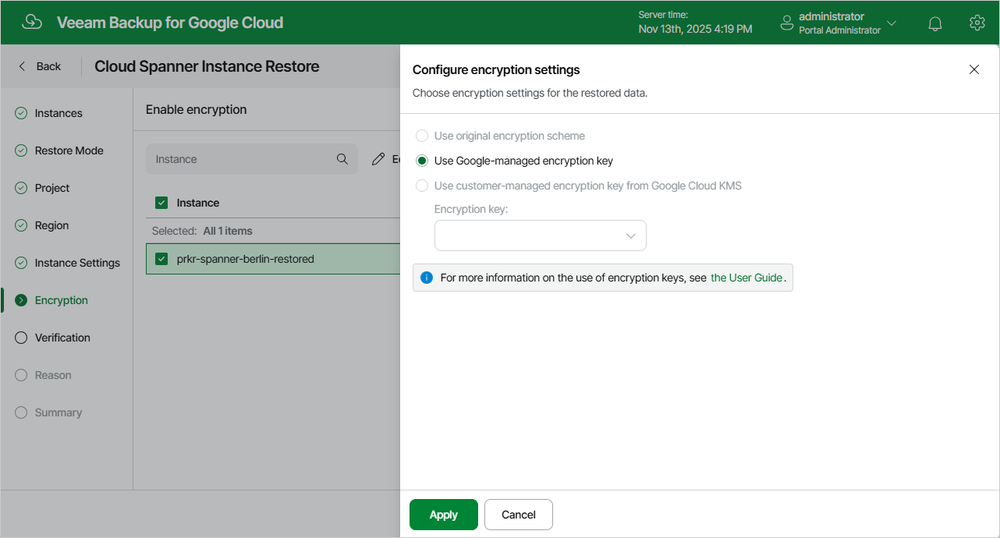

In this article

[This step applies only if you have selected the Restore to new location, or with different settings option at the Restore Mode step of the wizard]

At the Encryption step of the wizard, do the following:

1. Select the Cloud Spanner instance.
2. Click Edit.

1. In the opened window, choose whether you want the instance data to be encrypted with a Google Cloud KMS CMEK:

* If you want to apply the existing encryption scheme of the source Cloud Spanner instance, select the Use original encryption scheme option.
* If you want to apply Google-managed encryption scheme, select the Use Google-managed encryption key option.

* If you want to encrypt the restored data with a CMEK, select the Use customer-managed encryption key from Google Cloud KMS option and choose the necessary CMEK from the Encryption key drop-down list.

For a CMEK to be displayed in the list of available encryption keys, it must be stored in the region selected at [step 6](spanner_restore_region.md) of the wizard.

|  |
| --- |
| Notes |
| * Due to [technical limitations in Google Cloud](https://cloud.google.com/spanner/docs/use-cmek), Veeam Backup for Google Cloud does not support data encryption with multi-regional keys. * Due to [technical limitations in Google Cloud](https://cloud.google.com/spanner/docs/use-cmek), encrypting data with CMEKs is not supported for custom instance configurations with optional read-only replicas. If you want the instance data to be encrypted with a CMEK, the key must be stored in the same location as the restored Cloud Spanner instance (that is, for regional configuration — in the same region, and for multi-regional configuration — in the same multi-regional location). |

Page updated 11/14/2025

Page content applies to build 7.0.0.47
