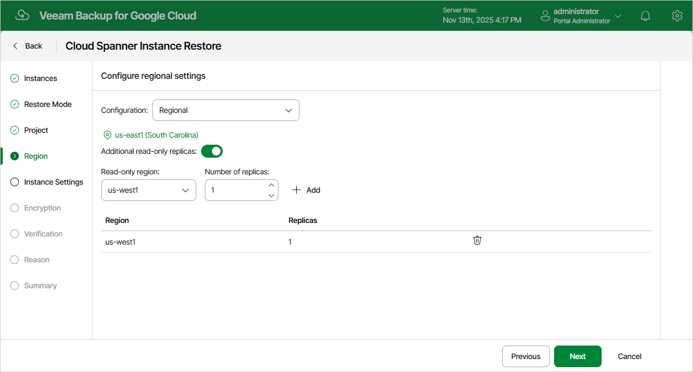

# Step 6. Configure Regional Settings

[This step applies only if you have selected the Restore to new location, or with different settings option at the Restore Mode step of the wizard]

At the Region step of the wizard, select an instance configuration for the restored Cloud Spanner instance. The configuration defines the geographic location where the instance data will be stored.

To configure the restored Cloud Spanner instance for high availability, select the Multi-region configuration, and choose base configurations that contain regions where replicas of the restored Cloud Spanner instance will be placed. The high availability configuration allows you to reduce the chance of downtime in case a zone or an entire region becomes unavailable. For more information on high availability and instance configurations in Google Cloud, see [Google Cloud documentation](https://cloud.google.com/spanner/docs/instance-configurations).

|  |
| --- |
| Tip |
| If some of the restored Cloud Spanner instances cannot be configured for high availability, the wizard will display a message notifying that the instances have issues with the original zone settings. To learn what these issues are, click the Instances link in the message. |

You can also add optional read-only replicas for both regional and multi-region instance configurations to increase your read capacity and data availability. If you set the Additional read-only replicas toggle to On, you must specify both regions where read-only replicas of the restored Cloud Spanner instance will be placed and the number of replicas in each region. If the Read-only region list does not include the location that you want to add, you can request a new optional read-only replica region as described in [Google Cloud documentation](https://cloud.google.com/spanner/docs/replication#read-only).

However, note that adding read-only replicas may increase read latency in case a read-only replica is added to a region belonging to a continent other than the one where replicas of the restored Cloud Spanner instance are located. To maintain low read latency in this scenario, it is recommended that you add 2 read-only replicas to a three-continent configuration as described in [Google Cloud documentation](https://cloud.google.com/spanner/docs/instance-configurations#three_continents ).

