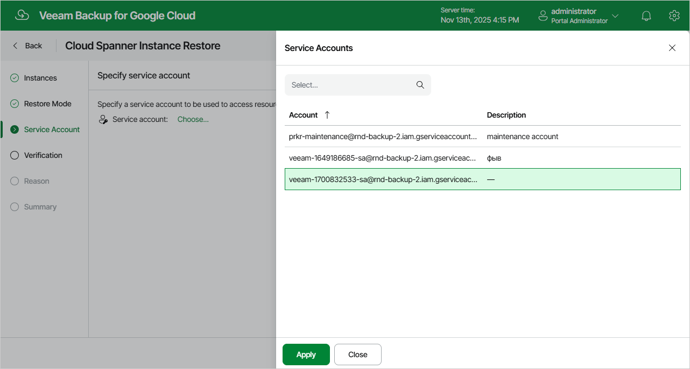

In this article

[This step applies only if you have selected the Restore to original location, with original settings option at the Restore Mode step of the wizard]

At the Service Account step of the wizard, select a service account whose permissions will be used to perform the restore operation. For more information on the required permissions, see [Service Account Permissions](restore_permissions.md#spanner).

For a service account to be displayed in the Service account drop-down list, it must be added to Veeam Backup for Google Cloud as described in section [Adding Service Accounts](adding_service_accounts.md), and must be assigned the Cloud Spanner Instances Restore operational role as described in section [Adding Projects and Folders](adding_projects.md).

If you have not added the necessary service account to Veeam Backup for Google Cloud beforehand, you can do it without closing the Cloud Spanner Instance Restore wizard. To do that, click Add and complete the Add Service Account wizard.

Page updated 11/14/2025

Page content applies to build 7.0.0.47
