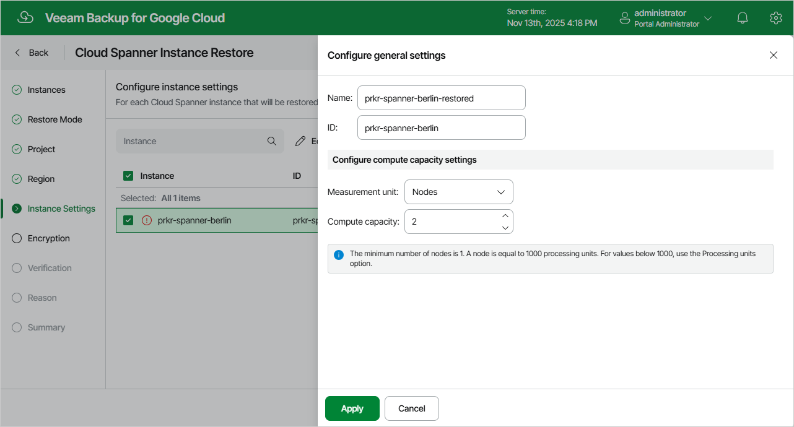

In this article

[This step applies only if you have selected the Restore to new location, or with different settings option at the Restore Mode step of the wizard]

At the Instance Settings step of the wizard, do the following:

1. Select the Cloud Spanner instance.
2. If you want to specify a new name and a new ID for the restored Cloud Spanner instance, or to configure compute capacity settings for the instance, click Edit.

In the Configure general settings window, specify the name and the ID, and click Apply.

You can also choose a new measurement unit and manually increase compute capacity for the restored Cloud Spanner instance. Note, however, that the amount of compute capacity allocated to an instance affects its cost. To learn how to configure compute capacity settings when creating a Cloud Spanner instance in Google Cloud, see [Google Cloud documentation](https://cloud.google.com/spanner/docs/compute-capacity).

|  |
| --- |
| Tip |
| If Veeam Backup for Google Cloud is unable to restore the Cloud Spanner instance using the specified ID for some reason, the wizard will display an error icon in the Instance column. To learn what this reason is, hover your mouse over the icon. |

Page updated 11/14/2025

Page content applies to build 7.0.0.47
