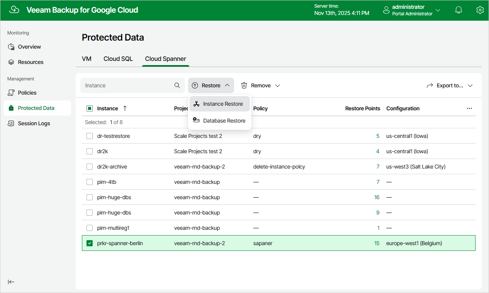

In this article

To launch the Cloud Spanner Instance Restore wizard, do the following:

1. Navigate to Protected Data > Cloud Spanner.
2. Select the Cloud Spanner instance that you want to restore, and click Restore > Instance Restore.

Page updated 11/14/2025

Page content applies to build 7.0.0.47
