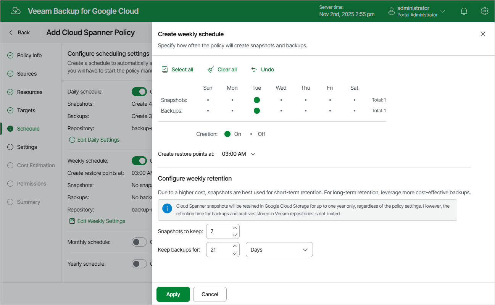

In this article

To create a weekly schedule for the backup policy, at the Schedule step of the wizard, do the following:

1. Set the Weekly schedule toggle to On and click Edit Weekly Settings.
2. In the Create weekly schedule section, select days when the backup policy will create cloud-native snapshots and image-level backups. Use the Create restore points at drop-down list to schedule a specific time for the backup policy to run.

|  |
| --- |
| Note |
| Veeam Backup for Google Cloud does not create image-level backups independently from cloud-native snapshots. That is why when you select days for image-level backups, the same days are automatically selected for cloud-native snapshots. To learn how Veeam Backup for Google Cloud performs backup, see [Spanner Backup](backup_spanner.md). |

1. In the Configure weekly retention section, configure retention policy settings for the weekly schedule:

* For cloud-native snapshots, specify the number of restore points that you want to keep in a snapshot chain.

If the restore point limit is exceeded, Veeam Backup for Google Cloud removes the earliest restore point from the chain. For more information, see [Spanner Snapshot Retention](snapshot_retention_spanner.md).

* For image-level backups, specify the number of days (or months) for which you want to keep restore points in a backup chain.

If a restore point is older than the specified time limit, Veeam Backup for Google Cloud removes the restore point from the chain. For more information, see [Spanner Backup Retention](backup_retention_spanner.md).

1. To save changes made to the backup policy settings, click Apply.

Page updated 11/11/2025

Page content applies to build 7.0.0.47
