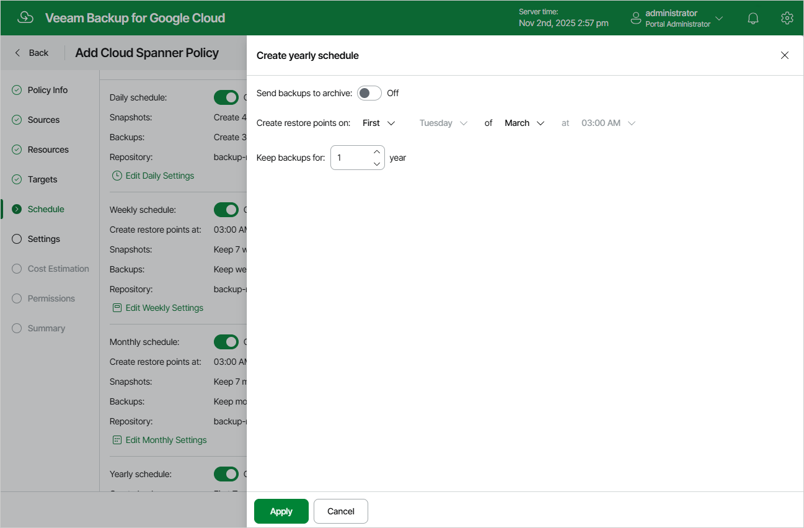

In this article

[This step applies only if you have instructed Veeam Backup for Google Cloud to create image-level backups at the Targets step of the wizard]

To create a yearly schedule for the backup policy, at the Schedule step of the wizard, do the following:

1. Set the Yearly schedule toggle to On and click Edit Yearly Settings.
2. In the Create yearly schedule section, specify a day, month and time when the backup policy will create image-level backups.

For example, if you select First, Tuesday, March and 03:00 AM, the backup policy will run every first Tuesday of March at 03:00 AM.

1. In the Keep backups for field, specify the number of years for which you want to keep restore points in a backup chain.

If a restore point is older than the specified time limit, Veeam Backup for Google Cloud removes the restore point from the chain. For more information, see [Retention Policy for Backups](backup_retention_spanner.md).

1. To save changes made to the backup policy settings, click Apply.

|  |
| --- |
| Tip |
| If you have enabled backup archiving at the Targets step of the wizard, and want to store yearly backups in an archive backup repository, set the Send backups to archive toggle to On, and follow the instructions provided in section [Enabling Backup Archiving](spanner_backup_archiving.md). |

Page updated 11/11/2025

Page content applies to build 7.0.0.47
