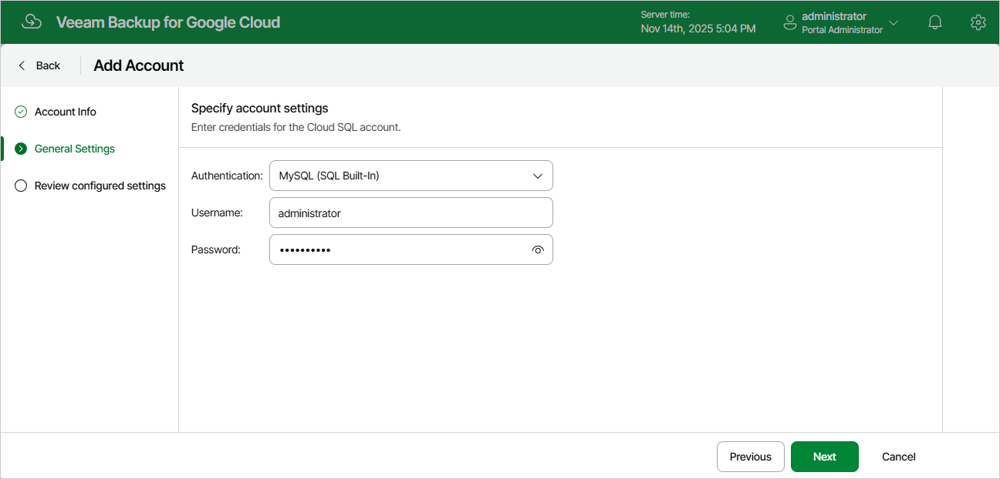

# Step 3. Specify General Settings

At the General Settings step of the wizard, choose whether you plan to use this account in PostgreSQL or MySQL backup policies, and specify credentials that the account will use to access instances protected by these policies.

