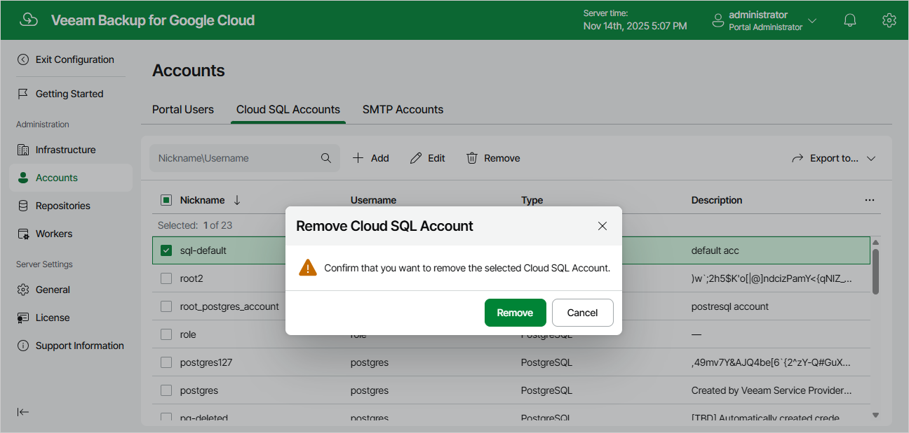

In this article

Veeam Backup for Google Cloud allows you to permanently remove a Cloud SQL account from the configuration database if you no longer need it:

1. Switch to the Configuration page.
2. Navigate to Accounts > Cloud SQL Accounts.
3. Select the account and click Remove.

|  |
| --- |
| Notes |
| * You cannot remove the default IAM Credentials account. * You cannot remove a Cloud SQL account that is associated with any backup policy. Delete all of the affected policies or [edit their settings](editing_policies_settings.md) — and then try removing the account again. |

Page updated 11/14/2025

Page content applies to build 7.0.0.47
