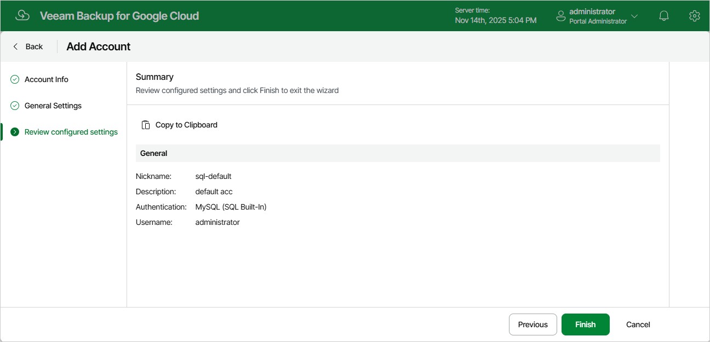

In this article

At the Summary step of the wizard, review summary information and click Finish.

|  |
| --- |
| Tip |
| After you add the Cloud SQL account, you will be able to specify this account while creating backup policies to allow Veeam Backup for Google Cloud to access source Cloud SQL instances. For more information, see [Performing SQL Backup](sql_policy_processing.md). |

Page updated 11/14/2025

Page content applies to build 7.0.0.47
