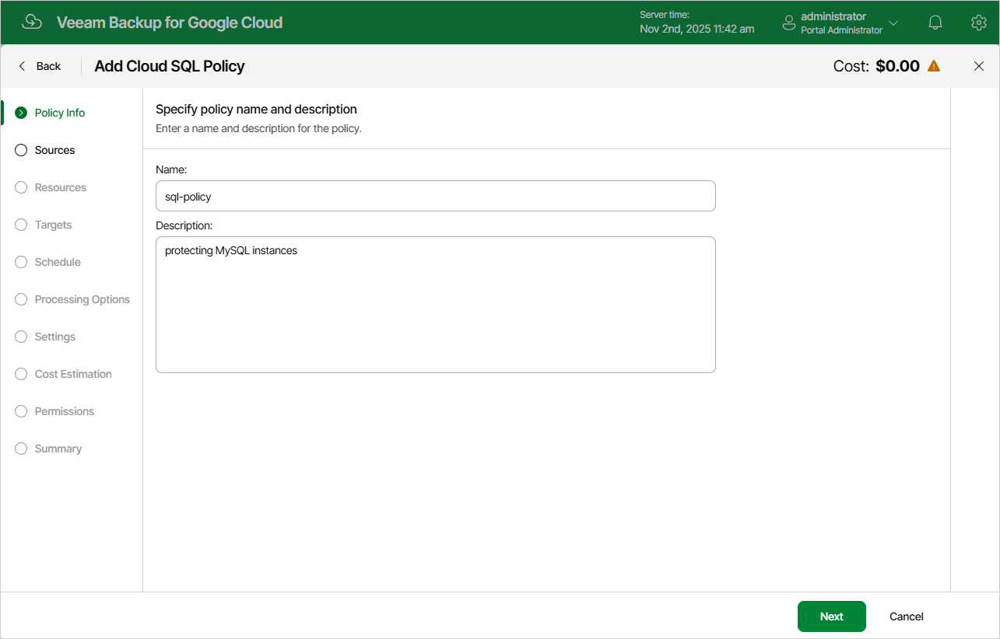

In this article

At the Policy Info step of the wizard, use the Name and Description fields to enter a name for the new backup policy and to provide a description for future reference. The policy name can contain only uppercase Latin letters, lowercase Latin letters, numeric characters and hyphens; the maximum length of the name is 127 characters.

|  |
| --- |
| Note |
| When Veeam Backup for Google Cloud runs a backup policy, it adds the word Veeam to the descriptions of snapshots created by the policy. |

Page updated 11/11/2025

Page content applies to build 7.0.0.47
