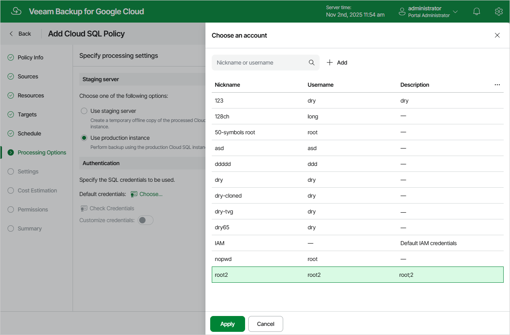
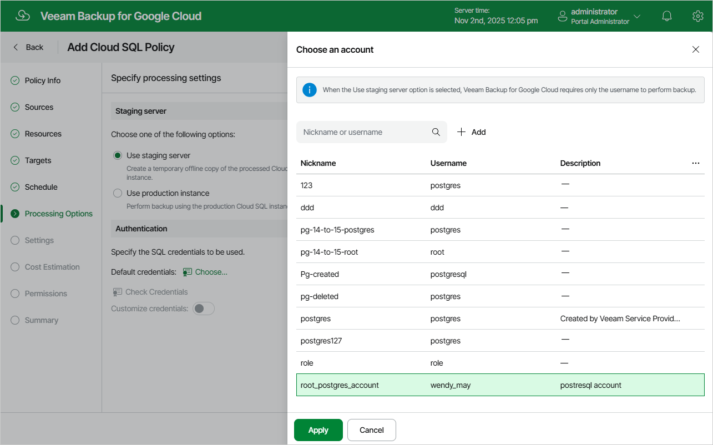

In this article

At the Processing Options step of the wizard, choose whether you want to use a staging server to perform backup operations. To learn how Veeam Backup for Google Cloud uses staging servers to protect Cloud SQL instances, see [SQL Backup](backup_sql.md).

|  |
| --- |
| Important |
| Consider the following:   * To allow Veeam Backup for Google Cloud to back up a Cloud SQL instance using a staging server, the Veeam.VB.SqlAccessBackup role must exist in the project used to deploy the worker instance. * If a Cloud SQL instance is configured to accept SSL connections, you will be able to back up the instance using a staging server only. |

Protecting Instances Without Staging Server

To back up the selected Cloud SQL instances without a staging server, do the following:

1. In the Staging server section, select the Use production instance option.
2. In the Authentication section, click Choose.
3. In the Choose an account window, select a service account whose credentials will be used to authenticate against the production Cloud SQL instances. For an account to be displayed in the list of available accounts, it must be added to Veeam Backup for Google Cloud as described in section [Managing Cloud SQL Accounts](add_sql_accounts.md).

If you select the [default IAM account](managing_sql_accounts.md), Veeam Backup for Google Cloud will access the instances using the service account that has been specified at [step 3](sql_policy_project.md).

|  |
| --- |
| Important |
| * If you select the default IAM account, the service account that will be used to access MySQL instances included into the backup scope must be granted the cloudsql.instances.login permission. For more information on Cloud SQL roles, see [Google Cloud documentation](https://cloud.google.com/sql/docs/mysql/iam-roles). * Regardless of the option you choose, make sure that the selected account has either the permissions required to perform database dumping operations or the cloudsqlsuperuser role assigned. |

By default, the selected account will be used to access all the instances added to the backup policy. You can also granularly specify credentials that Veeam Backup for Google Cloud will use to access specific production Cloud SQL instances. To do that, set the Customize credentials toggle to On, choose a resource for which you want to specify the credentials and click Edit Credentials.

|  |
| --- |
| Tip |
| It is recommended that you check whether the selected account exists on the protected instances. To do that, click Check Credentials. |

Protecting Instances With Staging Server

To back up the selected Cloud SQL instances using a staging server, select the Use staging server option in the Staging server section.

When performing backup with a staging server, Veeam Backup for Google Cloud uses the default administrator account to send REST API requests to MySQL instances processed by the backup policy — that is why there is no need to specify credentials for authentication against the processed instances. However, Veeam Backup for Google Cloud is unable to use the default administrator account for PostgreSQL instances due to technical limitations — that is why you must also do the following if the backup policy protects PostgreSQL instances:

1. In the Authentication section, click Choose.
2. In the Choose an account window, select a service account that exists on all PostgreSQL instances processed by the policy. Veeam Backup for Google Cloud will create a user with the specified name and one-time password on the staging server to get access to the instance databases and to perform the backup operation.

By default, the selected account will be used to access all the instances added to the backup policy. You can also granularly specify credentials that Veeam Backup for Google Cloud will use to access specific PostgreSQL instances. To do that, set the Customize credentials toggle to On, choose a resource for which you want to specify the credentials and click Edit Credentials.

|  |
| --- |
| Tip |
| It is recommended that you check whether the selected account exists on the protected instances. To do that, click Check Credentials. |

Page updated 11/11/2025

Page content applies to build 7.0.0.47
