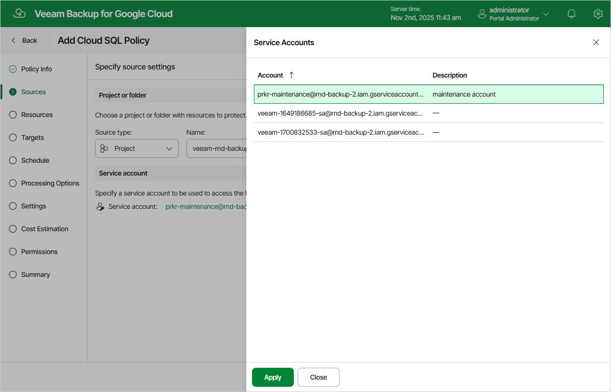

In this article

At the Sources step of the wizard, choose a project or a folder with a project that manages resources that you want to protect, and specify a service account that will be used to access the project or folder.

For a project or folder to be displayed in the list of available entities, it must be added to Veeam Backup for Google Cloud as described in section [Adding Projects and Folders](adding_projects.md). If you have not added the necessary entity to Veeam Backup for Google Cloud beforehand, you can do it without closing the Add Cloud SQL Policy wizard. To do that, click Add and complete the Add Projects and Folders wizard.

For a service account to be displayed in the list of available accounts, it must be added to Veeam Backup for Google Cloud as described in section [Adding Service Accounts](adding_service_accounts.md), and must be assigned the Cloud SQL Instances Snapshot and Backup operational roles as described in section [Adding Projects and Folders](adding_projects.md).

Page updated 11/11/2025

Page content applies to build 7.0.0.47
