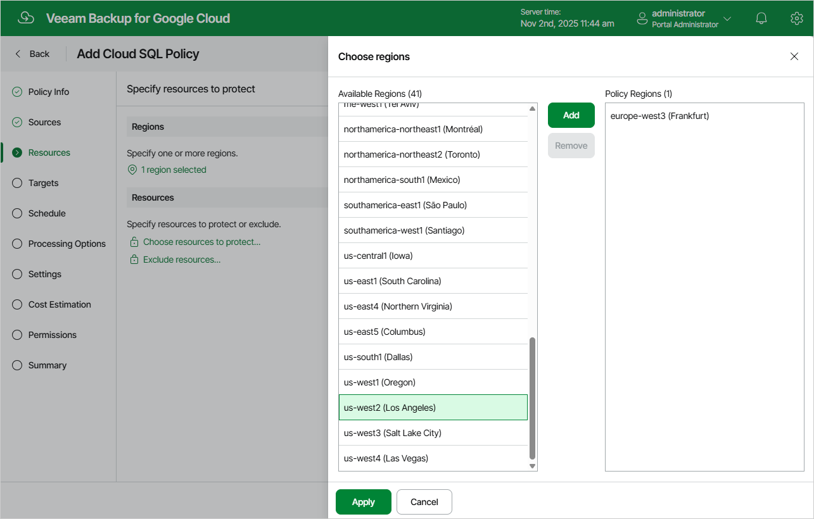

# Step 4a. Choose Regions

In the Regions section of the Resources step of the wizard, choose regions in which Cloud SQL instances that you want to protect reside.

1. Click Choose regions.
2. In the Choose regions window, select the necessary regions from the Available Regions list, and click Add.

1. To save changes made to the backup policy settings, click Apply.

