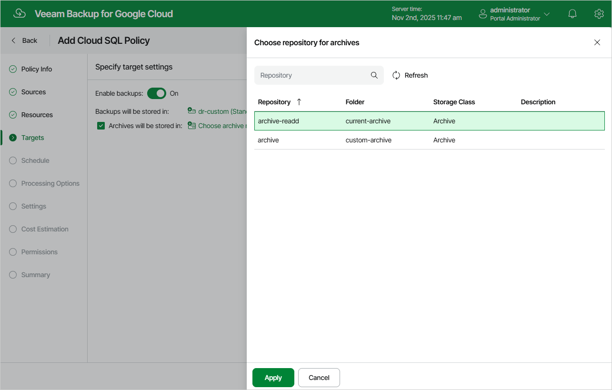

In this article

By default, backup policies create only cloud-native snapshots of processed instances. At the Targets step of the wizard, you can instruct Veeam Backup for Google Cloud to create image-level backups of the selected Cloud SQL instances:

1. Set the Enable backups toggle to On.
2. Click Choose repository.
3. In the Choose repository window, select a backup repository where the created image-level backups will be stored.

For a backup repository to be displayed in the Repository list, it must be added to Veeam Backup for Google Cloud as described in section [Adding Backup Repositories](adding_repositories.md). The Repository list shows only backup repositories of the Standard and Nearline storage classes.

1. To save changes made to the backup policy settings, click Apply.

You can also enable the backup archiving mechanism to instruct Veeam Backup for Google Cloud to store backed-up data in a low-cost, long-term archive storage:

1. Select the Archives will be stored in check box.
2. Click Choose repository.
3. In the Choose repository window, select a backup repository where the archived data will be stored.

For a backup repository to be displayed in the Repository list, it must be added to Veeam Backup for Google Cloud as described in section [Adding Backup Repositories](adding_repositories.md). The Repository list shows only backup repositories of the Archive storage class.

1. To save changes made to the backup policy settings, click Apply.

For more information on the backup archiving mechanism, see [Enabling Backup Archiving](sql_backup_archiving.md).

Page updated 11/11/2025

Page content applies to build 7.0.0.47
